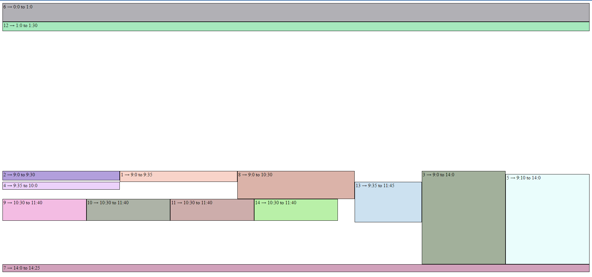
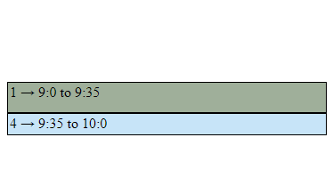

# Layout-Schedule
This library allows to layout events into a calendar for visualization, it generates the slots and its coordinates to draw it in a canvas or using absolute position.



## Installation

```shell
npm i @hjco/layout-schedule
```

### Configuration

```js
import {Calendar, Matrix} from '@hjco/layout-schedule'

// Select the instance or algorithm
const instance = (width, _, events) => new Matrix(events, width);
// Create a new calendar, pass a HTMLElement, JSON, and the instance 
calendar = new Calendar(width, height, input, instance);
// Draw each received slot wherever you prefer
calendar.draw(drawSlotFunction);
```

## Demo

[DEMO](https://haroldjcastillo.github.io/layout-schedule/)

## Examples

Given this events:

```json
 [
    {
        "id": "1",
        "start": "2023-06-13T09:00:00",
        "end": "2023-06-13T09:35:00",
    },
    {
        "id": "4",
        "start": "2023-06-13T09:35:00",
        "end": "2023-06-13T10:00:00",
    }
]
```

Result



```json
[
    {
        "rows": 35,
        "cols": 1,
        "event": {
            "id": "1",
            "start": "2023-06-13T07:00:00.000Z",
            "end": "2023-06-13T07:35:00.000Z"
        },
        "rectangle": {
            "x": 0,
            "y": 540,
            "width": 1133,
            "height": 35
        }
    },
    {
        "rows": 25,
        "cols": 1,
        "event": {
            "id": "4",
            "start": "2023-06-13T07:35:00.000Z",
            "end": "2023-06-13T08:00:00.000Z"
        },
        "rectangle": {
            "x": 0,
            "y": 575,
            "width": 1133,
            "height": 25
        }
    }
]
```
